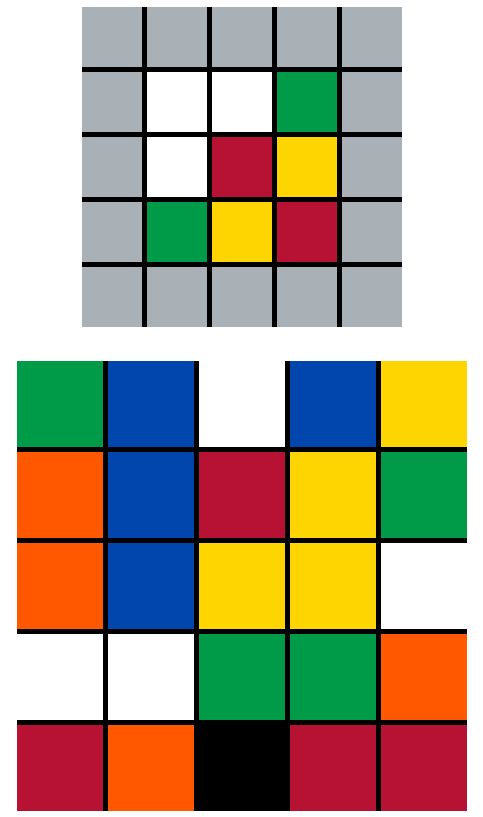

# A game of rubik

This is a small game I developed after seeing [this video](https://i.imgur.com/zzGT2J5.gifv) on Reddit.

> Try to rebuild the 3x3 square by moving blocks in the bigger 5x5 square.

[Play the game](https://a-game-of-rubik.vercel.app/)

## Available Scripts

In the project directory, you can run:

### `npm start`

Runs the app in the development mode.\
Open [http://localhost:3000](http://localhost:3000) to view it in your browser.

The page will reload when you make changes.\
You may also see any lint errors in the console.

## Learn More

You can learn more in the [Create React App documentation](https://facebook.github.io/create-react-app/docs/getting-started).

To learn React, check out the [React documentation](https://reactjs.org/).
